# **UIU Health Care System**

A comprehensive healthcare management system for the United International University community, offering affordable and accessible healthcare services using Laravel, ReactJS, and InertiaJS.

---

## **Features**

- 📹 **Instant Video Consultation**: Book and attend virtual consultations with doctors.
- 🕒 **Doctor Appointment Scheduling**: Schedule in-person or virtual appointments with doctors.
- 💊 **24/7 Medicine Delivery**: Order medicines with delivery services within the university premises.
- 📈 **Health Monitoring**: Track vitals and monitor health progress.
- 📂 **Health Records**: Securely manage and access health records.
- 🔔 **Medicine Schedule Tracking**: Receive reminders for taking medicines and managing schedules.
- 📝 **Digital Prescriptions**: Doctors can issue and update digital prescriptions.
- 🚨 **Emergency Services**: Quick access to emergency healthcare support.

---

## **Tech Stack**

- **Frontend**: ReactJS with InertiaJS
- **Backend**: Laravel
- **Database**: MySQL
- **Other Tools**: Tailwind CSS, Axios

---
## **Project Structure**
```plaintext
/uiu-health-care-system
├── /app             # Backend application logic
├── /resources       # Frontend files (React, InertiaJS)
├── /public          # Public assets (CSS, JS, images)
├── /routes          # Application routes
├── /database        # Migrations and seeders
├── /config          # Application configuration files
└── README.md        # Project documentation
```
---
## **ER Diagram**

```mermaid
erDiagram
    USERS {
        BIGINT user_id PK 
        VARCHAR name
        VARCHAR email 
        VARCHAR password
        VARCHAR role
        VARCHAR blood_group
        BOOLEAN available_for_donation
        VARCHAR phone
        TEXT address
        VARCHAR user_type
        VARCHAR emergency_contact
        TIMESTAMP created_at
        TIMESTAMP updated_at
    }

    DOCTORS {
        BIGINT doc_id PK "Primary Key"
        VARCHAR specialization
        JSON availability
        JSON educations
        JSON experience
        TIMESTAMP created_at
        TIMESTAMP updated_at
    }

    APPOINTMENTS {
        BIGINT appointment_id PK "Primary Key"
        BIGINT user_id FK "Foreign Key"
        BIGINT doctor_id FK "Foreign Key"
        VARCHAR reason
        DATE date
        TIME time
        TEXT description
        VARCHAR status
        TIMESTAMP status_updated_at
        TIMESTAMP created_at
        TIMESTAMP updated_at
    }

    CONSULTATIONS {
        BIGINT consultation_id PK "Primary Key"
        BIGINT doctor_id FK "Foreign Key"
        VARCHAR consultation_type
        TEXT notes
        TIMESTAMP created_at
        TIMESTAMP updated_at
    }

    PRESCRIPTIONS {
        BIGINT prescription_id PK "Primary Key"
        BIGINT user_id FK "Foreign Key"
        BIGINT doctor_id FK "Foreign Key"
        JSON prescription_details
        TIMESTAMP created_at
        TIMESTAMP updated_at
    }

    MEDICINES {
        BIGINT medicine_id PK "Primary Key"
        VARCHAR brand_name
        VARCHAR generic_name
        VARCHAR strength
        TEXT indication
        TEXT adult_dose
        TEXT child_dose
        TEXT side_effects
        VARCHAR form
        TEXT administration
        VARCHAR packsize
        DECIMAL price
        TIMESTAMP created_at
        TIMESTAMP updated_at
    }

    INVENTORY_MEDICINES {
        BIGINT inventory_medicine_id PK "Primary Key"
        VARCHAR name
        INT stock
        DECIMAL price
        TIMESTAMP created_at
        TIMESTAMP updated_at
    }

    CART {
        BIGINT cart_id PK "Primary Key"
        BIGINT user_id FK "Foreign Key"
        TIMESTAMP created_at
        TIMESTAMP updated_at
    }

    CART_ITEMS {
        BIGINT cart_item_id PK "Primary Key"
        BIGINT cart_id FK "Foreign Key"
        BIGINT medicine_id FK "Foreign Key"
        INT quantity
        DECIMAL price
        TIMESTAMP created_at
        TIMESTAMP updated_at
    }

    ORDERS {
        BIGINT order_id PK "Primary Key"
        BIGINT cart_id FK "Foreign Key"
        VARCHAR status
        TIMESTAMP status_updated_at
        TIMESTAMP created_at
        TIMESTAMP updated_at
    }

    PAYMENTS {
        BIGINT payment_id PK "Primary Key"
        BIGINT user_id FK "Foreign Key"
        BIGINT order_id FK "Foreign Key"
        DECIMAL amount
        VARCHAR payment_method
        VARCHAR status
        TIMESTAMP created_at
        TIMESTAMP updated_at
    }

    HEALTH_RECORDS {
        BIGINT health_record_id PK "Primary Key"
        BIGINT user_id FK "Foreign Key"
        BIGINT doctor_id FK "Foreign Key"
        JSON record_details
        TIMESTAMP created_at
        TIMESTAMP updated_at
    }

    MEDICAL_HISTORY {
        BIGINT medical_history_id PK "Primary Key"
        BIGINT user_id FK "Foreign Key"
        JSON record_details
        TIMESTAMP created_at
        TIMESTAMP updated_at
    }

    TEST_REPORTS {
        BIGINT test_report_id PK "Primary Key"
        BIGINT user_id FK "Foreign Key"
        BIGINT doctor_id FK "Foreign Key"
        TEXT report_details
        TIMESTAMP created_at
        TIMESTAMP updated_at
    }

    BLOOD_REQUESTS {
        BIGINT blood_request_id PK "Primary Key"
        BIGINT user_id FK "Foreign Key"
        VARCHAR blood_group
        VARCHAR status
        TIMESTAMP status_updated_at
        TIMESTAMP created_at
        TIMESTAMP updated_at
    }

    DONATION_RECORDS {
        BIGINT donation_record_id PK "Primary Key"
        BIGINT donor_id FK "Foreign Key"
        BIGINT request_id FK "Foreign Key"
        DATE donation_date
        VARCHAR blood_group
        TIMESTAMP created_at
        TIMESTAMP updated_at
    }

    USERS ||--o{ APPOINTMENTS : ""
    USERS ||--o{ PRESCRIPTIONS : ""
    USERS ||--o{ CART : ""
    USERS ||--o{ PAYMENTS : ""
    USERS ||--o{ HEALTH_RECORDS : ""
    USERS ||--o{ MEDICAL_HISTORY : ""
    USERS ||--o{ TEST_REPORTS : ""
    USERS ||--o{ BLOOD_REQUESTS : ""
    DOCTORS ||--o{ APPOINTMENTS : ""
    DOCTORS ||--o{ CONSULTATIONS : ""
    DOCTORS ||--o{ PRESCRIPTIONS : ""
    DOCTORS ||--o{ HEALTH_RECORDS : ""
    DOCTORS ||--o{ TEST_REPORTS : ""
    CART ||--o{ CART_ITEMS : ""
    CART_ITEMS ||--|| INVENTORY_MEDICINES : ""
    CART ||--o{ ORDERS : ""
    ORDERS ||--o{ PAYMENTS : ""
    BLOOD_REQUESTS ||--o{ DONATION_RECORDS : ""


    
```




## **Database Structure**
```sql
-- Users Table
CREATE TABLE users (
  user_id BIGINT PRIMARY KEY,
  name VARCHAR(255) NOT NULL,
  email VARCHAR(255) UNIQUE NOT NULL,
  password VARCHAR(255) NOT NULL,
  role VARCHAR(50) NOT NULL,
  blood_group VARCHAR(3),
  available_for_donation BOOLEAN,
  phone VARCHAR(20),
  address TEXT,
  user_type VARCHAR(20) NOT NULL,
  emergency_contact VARCHAR(20),
  created_at TIMESTAMP DEFAULT CURRENT_TIMESTAMP,
  updated_at TIMESTAMP DEFAULT CURRENT_TIMESTAMP ON UPDATE CURRENT_TIMESTAMP
);

-- Doctors Table
CREATE TABLE doctors (
  doc_id BIGINT PRIMARY KEY,
  specialization VARCHAR(255) NOT NULL,
  availability JSON,  -- Store schedules in JSON format
  educations JSON,  -- Store educational details in JSON format
  experience JSON,  -- Store experience in JSON format
  created_at TIMESTAMP DEFAULT CURRENT_TIMESTAMP,
  updated_at TIMESTAMP DEFAULT CURRENT_TIMESTAMP ON UPDATE CURRENT_TIMESTAMP
);

-- Appointments Table
CREATE TABLE appointments (
  appointment_id BIGINT PRIMARY KEY,
  user_id BIGINT NOT NULL,
  doctor_id BIGINT NOT NULL,
  reason VARCHAR(255),
  date DATE NOT NULL,
  time TIME NOT NULL,
  description TEXT,
  status VARCHAR(50) DEFAULT 'pending',
  status_updated_at TIMESTAMP DEFAULT CURRENT_TIMESTAMP,
  created_at TIMESTAMP DEFAULT CURRENT_TIMESTAMP,
  updated_at TIMESTAMP DEFAULT CURRENT_TIMESTAMP ON UPDATE CURRENT_TIMESTAMP,
  FOREIGN KEY (user_id) REFERENCES users(user_id),
  FOREIGN KEY (doctor_id) REFERENCES doctors(doc_id)
);

-- Consultations Table
CREATE TABLE consultations (
  consultation_id BIGINT PRIMARY KEY,
  doctor_id BIGINT NOT NULL,
  consultation_type VARCHAR(50) NOT NULL,
  notes TEXT,
  created_at TIMESTAMP DEFAULT CURRENT_TIMESTAMP,
  updated_at TIMESTAMP DEFAULT CURRENT_TIMESTAMP ON UPDATE CURRENT_TIMESTAMP,
  FOREIGN KEY (doctor_id) REFERENCES doctors(doc_id)
);

-- Prescriptions Table
CREATE TABLE prescriptions (
  prescription_id BIGINT PRIMARY KEY,
  user_id BIGINT NOT NULL,
  doctor_id BIGINT NOT NULL,
  prescription_details JSON,  -- Store detailed prescriptions in JSON format
  created_at TIMESTAMP DEFAULT CURRENT_TIMESTAMP,
  updated_at TIMESTAMP DEFAULT CURRENT_TIMESTAMP ON UPDATE CURRENT_TIMESTAMP,
  FOREIGN KEY (user_id) REFERENCES users(user_id),
  FOREIGN KEY (doctor_id) REFERENCES doctors(doc_id)
);

-- Medicines Table
CREATE TABLE medicines (
  medicine_id BIGINT PRIMARY KEY,
  brand_name VARCHAR(255) NOT NULL,
  generic_name VARCHAR(255),
  strength VARCHAR(50),
  indication TEXT,
  adult_dose TEXT,
  child_dose TEXT,
  side_effects TEXT,
  form VARCHAR(50),
  administration TEXT,
  packsize VARCHAR(50),
  price DECIMAL(10, 2) NOT NULL,
  created_at TIMESTAMP DEFAULT CURRENT_TIMESTAMP,
  updated_at TIMESTAMP DEFAULT CURRENT_TIMESTAMP ON UPDATE CURRENT_TIMESTAMP
);

-- Inventory Medicines Table
CREATE TABLE inventory_medicines (
  inventory_medicine_id BIGINT PRIMARY KEY,
  name VARCHAR(255) NOT NULL,
  `group` VARCHAR(50),
  stock INT NOT NULL,
  price DECIMAL(10, 2) NOT NULL,
  created_at TIMESTAMP DEFAULT CURRENT_TIMESTAMP,
  updated_at TIMESTAMP DEFAULT CURRENT_TIMESTAMP ON UPDATE CURRENT_TIMESTAMP
);

-- Cart Table
CREATE TABLE cart (
  cart_id BIGINT PRIMARY KEY,
  user_id BIGINT NOT NULL,
  created_at TIMESTAMP DEFAULT CURRENT_TIMESTAMP,
  updated_at TIMESTAMP DEFAULT CURRENT_TIMESTAMP ON UPDATE CURRENT_TIMESTAMP,
  FOREIGN KEY (user_id) REFERENCES users(user_id)
);

-- Cart Items Table
CREATE TABLE cart_items (
  cart_item_id BIGINT PRIMARY KEY,
  cart_id BIGINT NOT NULL,
  medicine_id BIGINT NOT NULL,
  quantity INT NOT NULL,
  price DECIMAL(10, 2) NOT NULL,  -- Store price at the time of adding to cart
  created_at TIMESTAMP DEFAULT CURRENT_TIMESTAMP,
  updated_at TIMESTAMP DEFAULT CURRENT_TIMESTAMP ON UPDATE CURRENT_TIMESTAMP,
  FOREIGN KEY (cart_id) REFERENCES cart(cart_id),
  FOREIGN KEY (medicine_id) REFERENCES inventory_medicines(inventory_medicine_id)
);

-- Orders Table
CREATE TABLE orders (
  order_id BIGINT PRIMARY KEY,
  cart_id BIGINT NOT NULL,
  status VARCHAR(50) DEFAULT 'pending',
  status_updated_at TIMESTAMP DEFAULT CURRENT_TIMESTAMP,
  created_at TIMESTAMP DEFAULT CURRENT_TIMESTAMP,
  updated_at TIMESTAMP DEFAULT CURRENT_TIMESTAMP ON UPDATE CURRENT_TIMESTAMP,
  FOREIGN KEY (cart_id) REFERENCES cart(cart_id)
);

-- Payments Table
CREATE TABLE payments (
  payment_id BIGINT PRIMARY KEY,
  user_id BIGINT NOT NULL,
  order_id BIGINT NOT NULL,
  amount DECIMAL(10, 2) NOT NULL,
  payment_method VARCHAR(50) NOT NULL,
  status VARCHAR(50) DEFAULT 'pending',
  created_at TIMESTAMP DEFAULT CURRENT_TIMESTAMP,
  updated_at TIMESTAMP DEFAULT CURRENT_TIMESTAMP ON UPDATE CURRENT_TIMESTAMP,
  FOREIGN KEY (user_id) REFERENCES users(user_id),
  FOREIGN KEY (order_id) REFERENCES orders(order_id)
);

-- Health Records Table
CREATE TABLE health_records (
  health_record_id BIGINT PRIMARY KEY,
  user_id BIGINT NOT NULL,
  doctor_id BIGINT,
  record_details JSON,  -- Store health records in JSON format
  created_at TIMESTAMP DEFAULT CURRENT_TIMESTAMP,
  updated_at TIMESTAMP DEFAULT CURRENT_TIMESTAMP ON UPDATE CURRENT_TIMESTAMP,
  FOREIGN KEY (user_id) REFERENCES users(user_id),
  FOREIGN KEY (doctor_id) REFERENCES doctors(doc_id)
);

-- Medical History Table
CREATE TABLE medical_history (
  medical_history_id BIGINT PRIMARY KEY,
  user_id BIGINT NOT NULL,
  record_details JSON,  -- Detailed history in JSON format
  created_at TIMESTAMP DEFAULT CURRENT_TIMESTAMP,
  updated_at TIMESTAMP DEFAULT CURRENT_TIMESTAMP ON UPDATE CURRENT_TIMESTAMP,
  FOREIGN KEY (user_id) REFERENCES users(user_id)
);

-- Test Reports Table
CREATE TABLE test_reports (
  test_report_id BIGINT PRIMARY KEY,
  user_id BIGINT NOT NULL,
  doctor_id BIGINT NOT NULL,
  report_details TEXT,  -- Report content
  created_at TIMESTAMP DEFAULT CURRENT_TIMESTAMP,
  updated_at TIMESTAMP DEFAULT CURRENT_TIMESTAMP ON UPDATE CURRENT_TIMESTAMP,
  FOREIGN KEY (user_id) REFERENCES users(user_id),
  FOREIGN KEY (doctor_id) REFERENCES doctors(doc_id)
);

-- Blood Requests Table
CREATE TABLE blood_requests (
  blood_request_id BIGINT PRIMARY KEY,
  user_id BIGINT NOT NULL,
  blood_group VARCHAR(3) NOT NULL,
  status VARCHAR(50) DEFAULT 'pending',
  status_updated_at TIMESTAMP DEFAULT CURRENT_TIMESTAMP,
  created_at TIMESTAMP DEFAULT CURRENT_TIMESTAMP,
  updated_at TIMESTAMP DEFAULT CURRENT_TIMESTAMP ON UPDATE CURRENT_TIMESTAMP,
  FOREIGN KEY (user_id) REFERENCES users(user_id)
);

-- Donation Records Table
CREATE TABLE donation_records (
  donation_record_id BIGINT PRIMARY KEY,
  donor_id BIGINT NOT NULL,
  request_id BIGINT,
  donation_date DATE NOT NULL,
  blood_group VARCHAR(3) NOT NULL,
  created_at TIMESTAMP DEFAULT CURRENT_TIMESTAMP,
  updated_at TIMESTAMP DEFAULT CURRENT_TIMESTAMP ON UPDATE CURRENT_TIMESTAMP,
  FOREIGN KEY (donor_id) REFERENCES users(user_id),
  FOREIGN KEY (request_id) REFERENCES blood_requests(blood_request_id)
);

```
---
## **User Roles**

### **Admin**
- Manage users, doctor schedules, and pharmacy inventory.
- Generate reports on appointments, deliveries, and usage analytics.

### **Doctor**
- Provide virtual and in-person consultations.
- Issue digital prescriptions and update health records.

### **Pharmacist**
- Process medicine orders and manage inventory.
- Ensure timely delivery of medicines.

### **Patient**
- Book appointments, attend consultations, and access health records.
- Order medicines and track schedules.

---
## **Getting Started**

### **Prerequisites**
Ensure the following are installed on your system:

1. [Node.js](https://nodejs.org/)  
2. [Composer](https://getcomposer.org/)  
3. [MySQL](https://www.mysql.com/)  
4. [Git](https://git-scm.com/)  

### **Setup Instructions**


#### **Step 1: Clone the Repository**
```bash
git clone https://github.com/YourUsername/UIU-Health-Care-System.git
cd UIU-Health-Care-System
```

#### **Step 2: Install Laravel Backend Dependencies**
Run the following command to install PHP dependencies:
```bash
composer install
```
#### **Step 3: Install Frontend Dependencies**
Run the following command to install Node.js dependencies:
```bash
npm install
```
#### **Step 4: Configure Environment Variables**
1. Copy the `.env.example` file and rename it to `.env`:
```bash
cp .env.example .env
```
2. Open the `.env` file in a text editor and update the following configurations:
*Database Settings:
```env
DB_CONNECTION=mysql
DB_HOST=127.0.0.1
DB_PORT=3306
DB_DATABASE=uiu_healthcare
DB_USERNAME=your_db_username
DB_PASSWORD=your_db_password
```

#### **Step 5: Generate Application Key**
Run the following command to generate a unique application key:
```bash
php artisan key:generate
```
#### **Step 6: Run Database Migrations and Seeders**
Set up the database schema and populate it with initial data:
```bash
php artisan migrate --seed
```
#### **Step 7: Build the Frontend**
Build the ReactJS frontend using InertiaJS:
```bash
npm run dev
```
#### **Step 8: Start the Application**
Start the Laravel development server:
```
php artisan serve
```
#### **Step 9: Access the Application**
Open your browser and navigate to:
```plaintext
http://localhost:8000
```

